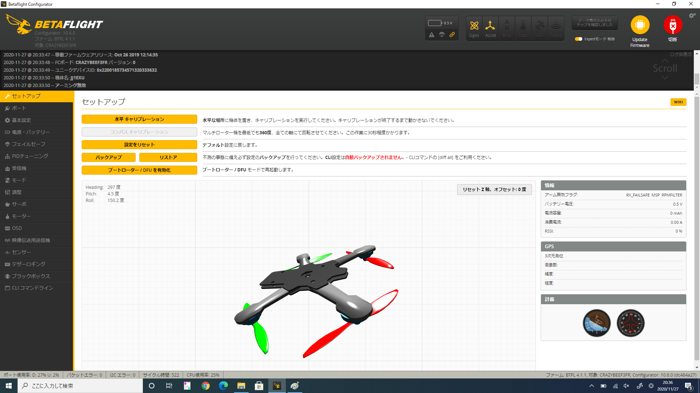

# Betaflightの設定 (CrazyBee F3 FR 編)

## セットアップ
下記は、CrazyBee F3に特化したBetaflightでの説明を致します。  
2020年11月現在、CrazyBeeF3はF3チップ利用が故にBetaflight 4.0系でサポートが終了されています。そのため通常では最終バージョンであるBetaflight 4.0.6をご利用ください。  
ですが、有志の手によりF3チップでも利用可能なBetaflight 4.1.1 Performance Editionという、メモリ容量の制約から機能を限定させたカスタムファームウェアが提供されています。これによりRPMフィルターなど最新の機能も利用可能です。今回はそのファームウェアを用いた設定参考パラメータを展開致します。  

### 水平キャリブレーション
大きくメンテナンスを施した後、またはファームウェアを書き換えた後は、必ず【水平キャリブレーション】を実施してください。  
機体に水平データが含まれていないとアームすることができませんのでご注意ください。

### バックアップ
このボタンは、近々にマージされた最新の機能や追加モジュール、CLIコマンドでしか提供されないパラメータをバックアップすることができません。そのためCLI コマンドプロンプトを利用し【diff all】もしくは【dump all】で出力された文字列をメモ帳などにコピーして、設定のバックアップを行ってください。

Betaflight (詳細設定) の項目は以下の通りです。必要なページをお選びください：

* [ポート](Betaflight%20-%20CrazyBeeF3_Port.md)
* [基本設定](Betaflight%20-%20CrazyBeeF3_BaseSetting.md)
* [電源・バッテリー](Betaflight%20-%20CrazyBeeF3_Battery.md)
* [フェイルセーフ](Betaflight%20-%20CrazyBeeF3_failsafe.md)
* [PIDチューニング](Betaflight%20-%20CrazyBeeF3_PID.md)
* [受信機](Betaflight%20-%20CrazyBeeF3_Reciever.md)
* [モード](Betaflight%20-%20CrazyBeeF3_Mode.md)
* [調整](Betaflight%20-%20CrazyBeeF3_Addjust.md)
* [サーボ](Betaflight%20-%20CrazyBeeF3_Servo.md)
* [モーター](Betaflight%20-%20CrazyBeeF3_Motor.md)
* [OSD](Betaflight%20-%20CrazyBeeF3_OSD.md)
* [映像伝送用送信機](Betaflight%20-%20CrazyBeeF3_VTX.md)
* [センサー](Betaflight%20-%20CrazyBeeF3_Sensor.md)
* [テザーロギング](Betaflight%20-%20CrazyBeeF3_logging.md)
* [ブラックボックス](Betaflight%20-%20CrazyBeeF3_Blackbox.md)
* [CLI コマンドライン](Betaflight%20-%20CrazyBeeF3_CLI.md)

