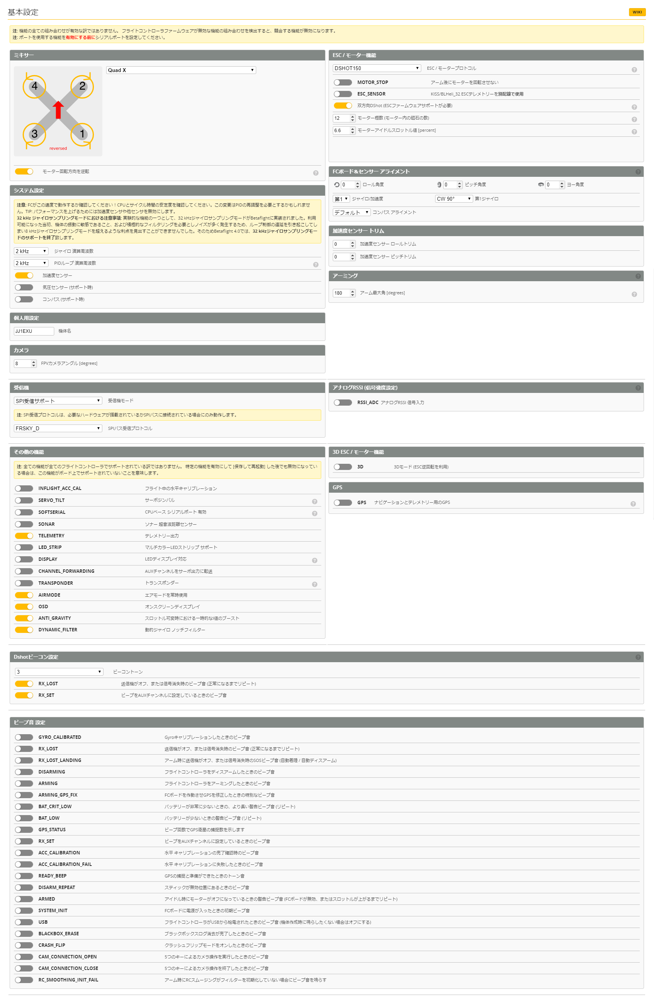

# 基本設定
この項目は、Betaflightのモーター、センサー、受信機など入出力を司るパラメータを設定する箇所となります。  
下記内容を確認し自身の機体に合わせて設定を実施してください。

### ミキサー
プロペラの回転方向を示します。  
この設定を行うことで回転方向を変更するものではなく、あくまでもFC基板がその指定した回転数で処理を行うというパラメータとなります。実際の回転方向は、CrazyBeeF3のようなブラシレスモーターを利用する場合は、CW/CCW配線を入れ替えるか、ESC設定にて回転方向をノーマル/リバース設定に変更します。  
また回転方向を変更する場合は、プロペラ形状(向き)もご注意ください。

### ESC / モーター機能
* デジタル処理となるDSHOTプロトコルが選択できます。RPMフィルターを用いる場合はDSHOTを選択してください。Betaflight 4.0.6を使用する場合は【DSHOT300】、Betaflight 4.1.1 PEを使用する場合は【DSHOT150】を選択するとバランスが良いとされています。機体やモーター構成との兼ね合いで前後調整ください。
* 【MOTOR_STOP】はアーム時にプロペラを回すか回さないかを選択します。好みでお選びください。
* 【双方向DSHOT】はBetaflight 4.1.1 PEを利用する際は、是非お奨めの設定となります。BLHeli_M(JazzMarverick)、もしくはJESC ESCファームウェアを別途インストールしてください。
* 【モーター極数】はブラシレスモーター内のモーターベルに付随する磁石の数です。Happymodel 0603、0802モーターは【12】となります。
* 【モーターアイドルスロットル値】はスロットル最低値におけるプロペラのアイドリング強度となります。Betaflightのバージョン、プロトコル、双方向DSHOT等の設定により前後しますが、上記の設定とする場合には0603モーターの場合は6.4～6.6程度で調整してみてください。

### FCボード & センサーアライメント
* 【第1】ジャイロ/加速度
* 【CW 90°】第1ジャイロ  
※ CrazyBeeF3FRの場合には上記値が初期値となります。

### アーミング
* 【180】アーム最大値  
※ Flip over after crash(タートル)モードを利用する場合は、こちらを【180】と設定してください。

### システム設定
* 【2kHz】ジャイロ演算周波数
* 【2kHz】PIDループ演算周波数  
※ Betaflight 4.0.6の場合は4k/4k以下、Betaflight 4.1.1 PEの場合は2k/2k以下で調整ください。

### カメラ
* 【8～15】FPVカメラアングル
※ ピッチを入れ前進した状態でヨーで機体を左右に曲げる際、その傾いた状態を0度として扱い処理をする機能です。(ロール補正が入ります。) この設定をすることで、ヨー操作をする際のFPV映像に対し、極端な角度がつかなくなり、方向展開時に自然な映像となります。この値は正確な角度(digree)ではありませんのでご注意ください。

### 受信機
* 【SPI受信サポート】
* 【FrSky_D / FrSky_X / S-FHSS】  
※ オンボード受信機を利用する場合にはSPI受信機サポートを選択してください。また、送信機のプロトコルによってFrSky_D / FrSky_X / S-FHSSを調整ください。  
※ また外付け受信機を別途利用する場合には、[外付け受信機の設定方法](HowtouseExternalrecevieronCrazybeeF3flightcontroller.pdf) をご覧ください。

### アナログRSSI
* 【無効：RSSI_ADC】  
※ この設定は、外付けRSSIテレメトリーモジュールを利用する際に有効とします。オンボード受信機にてFrSky_Xプロトコルを使用する場合は、無効のままでもOSDにてRSSI表示が可能です。

### 3D ESC / モーター機能
* 【無効：3D】  
※ 背面飛行等を用いるような3Dフリースタイル飛行の場合に有効としてください。

### GPS
* 【無効：GPS】  
※ ハードウェアGPSモジュールを搭載し、GPSレスキュー機能を使用する場合に有効とします。

### その他の機能
* 【有効：TELEMETRY】
* 【有効：AIRMODE】
* 【有効：OSD】
* 【有効：ANTI_GRAVITY】
* 【有効：DYNAMIC_FILTER】  
※ TELEMETRYはFrSky_D、FrSky_Xプロトコル利用時に、送信機側(OpenTX)に設定することで有効となります。(RSSIは関係なくOSD表示可能です。) AIRMODEを有効とするとスイッチ制御ではなく常時AIRモードとなります。OSDはFPVゴーグル上に各種飛行情報をオーバーレイ表示させることができます。ANTI_GRAVITYはスロットルを素早く操作させた際のブースト機能、DYNAMIC_FILTERは動的フィルターとなり、この2つは是非有効とすることで飛行しやすくなります。

### Dshotビーコン設定
* 【3】ビーコントーン
* 【RX_LOST】
* 【RX_SET】
※ ビーコントーンは音階のためお好みで、RX_LOSTは送信機とのリンク切れの際の音、RX_SETはスイッチでブザーと同様に音を鳴らすことが可能です。

### ビープ音設定
※ 基本は全て無効で問題ありませんが、FC基板側にブザーを設置した場合には必要に応じて有効にしてください。

### メニュー
Betaflight (詳細設定) の項目は以下の通りです。必要なページをお選びください：  

* [セットアップ](Betaflight%20-%20CrazyBeeF3FR.md)
* [ポート](Betaflight%20-%20CrazyBeeF3_Port.md)
* [基本設定](Betaflight%20-%20CrazyBeeF3_BaseSetting.md)
* [電源・バッテリー](Betaflight%20-%20CrazyBeeF3_Battery.md)
* [フェイルセーフ](Betaflight%20-%20CrazyBeeF3_failsafe.md)
* [PIDチューニング](Betaflight%20-%20CrazyBeeF3_PID.md)
* [受信機](Betaflight%20-%20CrazyBeeF3_Reciever.md)
* [モード](Betaflight%20-%20CrazyBeeF3_Mode.md)
* [調整](Betaflight%20-%20CrazyBeeF3_Addjust.md)
* [サーボ](Betaflight%20-%20CrazyBeeF3_Servo.md)
* [モーター](Betaflight%20-%20CrazyBeeF3_Motor.md)
* [OSD](Betaflight%20-%20CrazyBeeF3_OSD.md)
* [映像伝送用送信機](Betaflight%20-%20CrazyBeeF3_VTX.md)
* [センサー](Betaflight%20-%20CrazyBeeF3_Sensor.md)
* [テザーロギング](Betaflight%20-%20CrazyBeeF3_logging.md)
* [ブラックボックス](Betaflight%20-%20CrazyBeeF3_Blackbox.md)
* [CLI コマンドライン](Betaflight%20-%20CrazyBeeF3_CLI.md)

