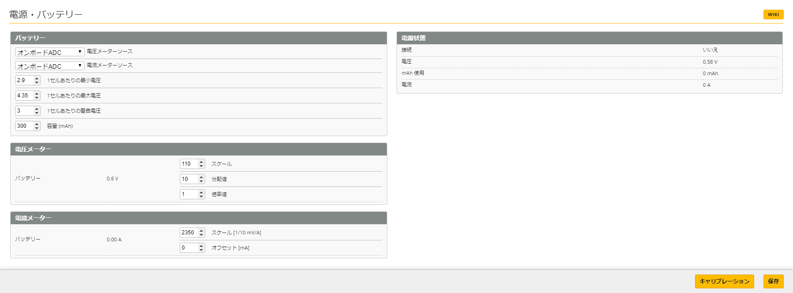

# 電源・バッテリー
この項目は主に電源に関わるセンサーの設定と利用するバッテリーのパラメータを指定します。  
利用環境に合わせ調整をしてください。

### バッテリー
* 【オンボードADC】電圧メーターソース
* 【オンボードADC】電流メーターソース
* 【2.9】 1セルあたりの最小電圧
* 【4.35】1セルあたりの最大電圧
* 【3】   1セルあたりの警告電圧 (3.0と表示できず)
* 【300】 容量 (mAh)
※ 1セルあたりの最小電圧は2.9～3.1程度としてください。それ以上低い値とした場合はリポバッテリーの負荷をかけ寿命を縮めてしまいますのでご注意ください。またあまりにも電圧を低くしてしまった場合には、FC基板が不安定となり設定値が全て消去されてしまいます。それを抑止する上でも電圧管理は十分に気を付けてください。Li-HVバッテリーは最大電圧4.35Vとなります。容量は使用している製品に合わせ変更をしてください。(250～300mAh)

### メニュー
Betaflight (詳細設定) の項目は以下の通りです。必要なページをお選びください：  

* [セットアップ](Betaflight%20-%20CrazyBeeF3FR.md)
* [ポート](Betaflight%20-%20CrazyBeeF3_Port.md)
* [基本設定](Betaflight%20-%20CrazyBeeF3_BaseSetting.md)
* [電源・バッテリー](Betaflight%20-%20CrazyBeeF3_Battery.md)
* [フェイルセーフ](Betaflight%20-%20CrazyBeeF3_failsafe.md)
* [PIDチューニング](Betaflight%20-%20CrazyBeeF3_PID.md)
* [受信機](Betaflight%20-%20CrazyBeeF3_Reciever.md)
* [モード](Betaflight%20-%20CrazyBeeF3_Mode.md)
* [調整](Betaflight%20-%20CrazyBeeF3_Addjust.md)
* [サーボ](Betaflight%20-%20CrazyBeeF3_Servo.md)
* [モーター](Betaflight%20-%20CrazyBeeF3_Motor.md)
* [OSD](Betaflight%20-%20CrazyBeeF3_OSD.md)
* [映像伝送用送信機](Betaflight%20-%20CrazyBeeF3_VTX.md)
* [センサー](Betaflight%20-%20CrazyBeeF3_Sensor.md)
* [テザーロギング](Betaflight%20-%20CrazyBeeF3_logging.md)
* [ブラックボックス](Betaflight%20-%20CrazyBeeF3_Blackbox.md)
* [CLI コマンドライン](Betaflight%20-%20CrazyBeeF3_CLI.md)

