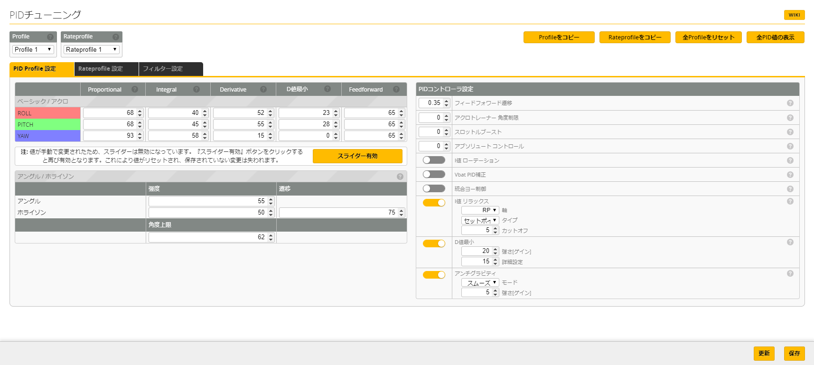
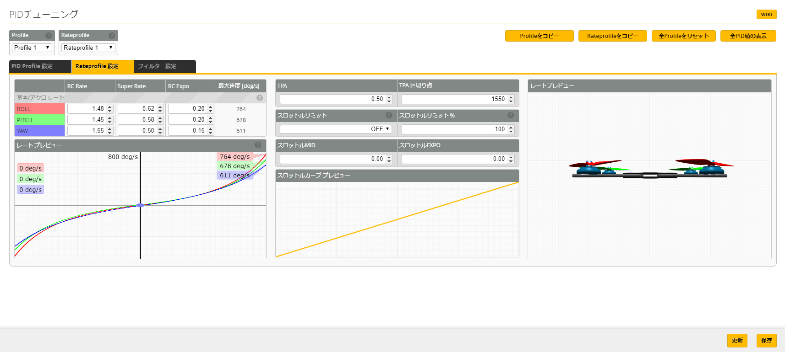
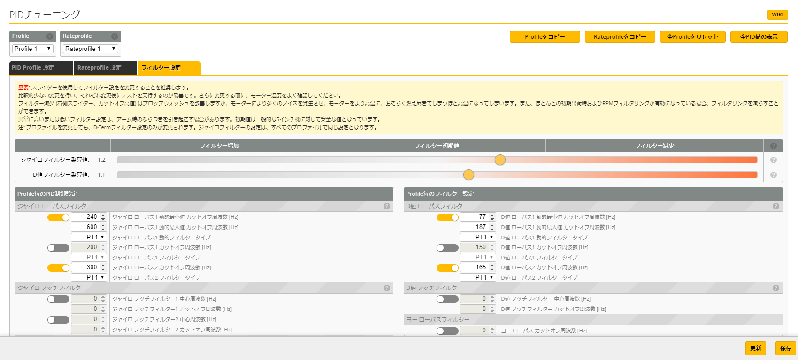

# PIDチューニング
この項目は、機体の挙動(フィーリング)に関わるパラメータとなります。PID値における理論や説明はこの中では割愛しますが、機体制御に伴うPID制御は船舶や飛行機、自動車などの自動運転の基本となる制御となりますので、是非理解を深めてみてください。

今回ここで公開するパラメータは、[横浜スライダーサイクルズ](https://srider.yokohama/) 三柴氏によるチューニング値を採用しています。

### PIDプロファイル設定
   |       | P値 | I値 | D値 | D最小 | FF値 |
   | :---: | :-: | :-: | :-: | :--: | :--: |
   | ROLL  | 68  | 40  | 52  | 23   | 65   |
   | PITCH | 68  | 45  | 55  | 28   | 65   |
   | YAW   | 93  | 58  | 15  | 0    | 65   |

### アングル/ホライズンの強度と遷移
   |           | 強度 | 遷移 |
   | :-------: | :--: | :-: |
   | アングル   | 55  |     |
   | ホライズン | 50  | 75  |

### 角度上限(アングルリミット)
* 【62】Angle Limit

### PIDコントローラ設定
* 【0.35】フィードフォワード遷移
* 【0】アクロトレーナー角度制限
* 【0】スロットルブースト
* 【0】アブソリュートコントロール

* 【無効：I値ローテーション】
* 【無効：Vbat PID補正】
* 【無効：統合ヨー制御】
* 【有効：I値リラックス】
   * 【RP】軸
   * 【セットポイント】タイプ
   * 【5】カットオフ
* 【有効：D値最小】
   * 【20】強さ(ゲイン)
   * 【15】詳細設定
* 【有効：アンチグラビティ】
   * 【スムーズ】モード
   * 【5】強さ(ゲイン)
   

### いいいい

### うううう

#### ええええ

### メニュー
Betaflight (詳細設定) の項目は以下の通りです。必要なページをお選びください：  

* [セットアップ](Betaflight%20-%20CrazyBeeF3FR.md)
* [ポート](Betaflight%20-%20CrazyBeeF3_Port.md)
* [基本設定](Betaflight%20-%20CrazyBeeF3_BaseSetting.md)
* [電源・バッテリー](Betaflight%20-%20CrazyBeeF3_Battery.md)
* [フェイルセーフ](Betaflight%20-%20CrazyBeeF3_failsafe.md)
* [PIDチューニング](Betaflight%20-%20CrazyBeeF3_PID.md)
* [受信機](Betaflight%20-%20CrazyBeeF3_Reciever.md)
* [モード](Betaflight%20-%20CrazyBeeF3_Mode.md)
* [調整](Betaflight%20-%20CrazyBeeF3_Addjust.md)
* [サーボ](Betaflight%20-%20CrazyBeeF3_Servo.md)
* [モーター](Betaflight%20-%20CrazyBeeF3_Motor.md)
* [OSD](Betaflight%20-%20CrazyBeeF3_OSD.md)
* [映像伝送用送信機](Betaflight%20-%20CrazyBeeF3_VTX.md)
* [センサー](Betaflight%20-%20CrazyBeeF3_Sensor.md)
* [テザーロギング](Betaflight%20-%20CrazyBeeF3_logging.md)
* [ブラックボックス](Betaflight%20-%20CrazyBeeF3_Blackbox.md)
* [CLI コマンドライン](Betaflight%20-%20CrazyBeeF3_CLI.md)

