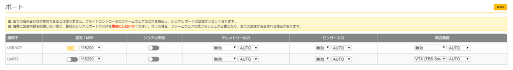

# ポート
この項目は、FC基板で使用可能なUARTポートの設定を行います。  
基本的には工場出荷時から変更する必要はありません。また誤った設定を施してしまうと、UARTポートの構成が変わりMicroUSBでBetaflight Configuratorへ接続できなくなってしまいますのでご注意ください。  
OSD上でVTX周波数調整が可能な【TBS SmartAudio】機能を使用したい場合は設定を行ってください。  

| 識別子  | 設定／MSP    | シリアル受信 | テレメトリー出力 | センサー入力 | 周辺機器             |  
| ------- | ----------- | ----------- | --------------- | ----------- | ------------------- |  
| USB VCP | 有効／115200 | 無効         | 無効／AUTO       | 無効／AUTO   | 無効／AUTO           |  
| UART3   | 無効         | 無効         | 無効／AUTO       | 無効／AUTO   | VTX (TBS SmartAudio) |  

### メニュー
Betaflight (詳細設定) の項目は以下の通りです。必要なページをお選びください：  

* [セットアップ](Betaflight%20-%20CrazyBeeF3FR.md)
* [ポート](Betaflight%20-%20CrazyBeeF3_Port.md)
* [基本設定](Betaflight%20-%20CrazyBeeF3_BaseSetting.md)
* [電源・バッテリー](Betaflight%20-%20CrazyBeeF3_Battery.md)
* [フェイルセーフ](Betaflight%20-%20CrazyBeeF3_failsafe.md)
* [PIDチューニング](Betaflight%20-%20CrazyBeeF3_PID.md)
* [受信機](Betaflight%20-%20CrazyBeeF3_Reciever.md)
* [モード](Betaflight%20-%20CrazyBeeF3_Mode.md)
* [調整](Betaflight%20-%20CrazyBeeF3_Addjust.md)
* [サーボ](Betaflight%20-%20CrazyBeeF3_Servo.md)
* [モーター](Betaflight%20-%20CrazyBeeF3_Motor.md)
* [OSD](Betaflight%20-%20CrazyBeeF3_OSD.md)
* [映像伝送用送信機](Betaflight%20-%20CrazyBeeF3_VTX.md)
* [センサー](Betaflight%20-%20CrazyBeeF3_Sensor.md)
* [テザーロギング](Betaflight%20-%20CrazyBeeF3_logging.md)
* [ブラックボックス](Betaflight%20-%20CrazyBeeF3_Blackbox.md)
* [CLI コマンドライン](Betaflight%20-%20CrazyBeeF3_CLI.md)

