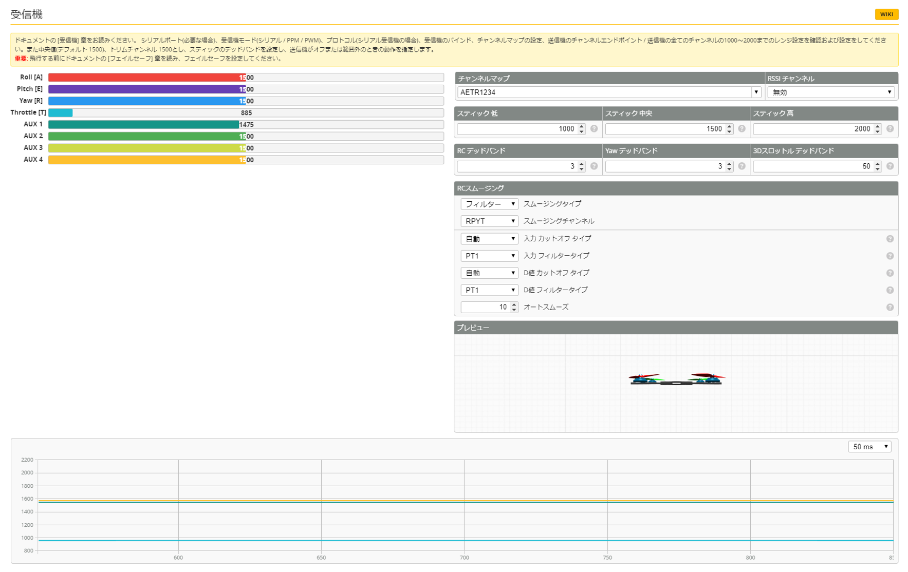

# 受信機
　この項目は、内蔵および外付け受信機との設定を示します。内蔵受信機の場合はSPI接続、外付け受信機の場合はSBUS等でフライトコントローラとの接続が行われ、送信機からの信号をBetaflightが受け取りこのスライドバーに値が表示されます。事前に送信機と受信機とを正しくバインドさせると、スティックを動作させることでスライドバーが左右に可変します。動作しない場合は、再度送信機と受信機とのバインドを見直してください。

### チャンネル関連
   | チャンネルマップ | RSSIチャンネル |
   | :------------: | :-----------: |
   | AETR1234       | 無効          |

### スティック関連
   | スティック 低 | スティック 中央 | スティック 高 |
   | :----------: | :------------: | :----------: |
   | 1000         | 1500           | 2000         |

### デッドバンド関連
   | RC デッドバンド | Yaw デッドバンド | 3Dスロットルデッドバンド |
   | :------------: | :-------------: | :--------------------: |
   | 3              | 3               | 50                     |

### RCスムージング
   | 項目       | タイプ                  |
   | :--------: | :--------------------: |
   | フィルター  | スムージングタイプ      |
   | RPYT       | スムージングチャンネル   |
   | 自動       | 入力カットオフタイプ     |
   | PT1        | 入力フィルタータイプ    |
   | 自動       | D値 カットオフタイプ    |
   | PT1        | D値 フィルタータイプ    |
   | 10         | オートスムーズ         |

### メニュー
Betaflight (詳細設定) の項目は以下の通りです。必要なページをお選びください：  

* [セットアップ](Betaflight%20-%20CrazyBeeF3FR.md)
* [ポート](Betaflight%20-%20CrazyBeeF3_Port.md)
* [基本設定](Betaflight%20-%20CrazyBeeF3_BaseSetting.md)
* [電源・バッテリー](Betaflight%20-%20CrazyBeeF3_Battery.md)
* [フェイルセーフ](Betaflight%20-%20CrazyBeeF3_failsafe.md)
* [PIDチューニング](Betaflight%20-%20CrazyBeeF3_PID.md)
* [受信機](Betaflight%20-%20CrazyBeeF3_Reciever.md)
* [モード](Betaflight%20-%20CrazyBeeF3_Mode.md)
* [調整](Betaflight%20-%20CrazyBeeF3_Addjust.md)
* [サーボ](Betaflight%20-%20CrazyBeeF3_Servo.md)
* [モーター](Betaflight%20-%20CrazyBeeF3_Motor.md)
* [OSD](Betaflight%20-%20CrazyBeeF3_OSD.md)
* [映像伝送用送信機](Betaflight%20-%20CrazyBeeF3_VTX.md)
* [センサー](Betaflight%20-%20CrazyBeeF3_Sensor.md)
* [テザーロギング](Betaflight%20-%20CrazyBeeF3_logging.md)
* [ブラックボックス](Betaflight%20-%20CrazyBeeF3_Blackbox.md)
* [CLI コマンドライン](Betaflight%20-%20CrazyBeeF3_CLI.md)

