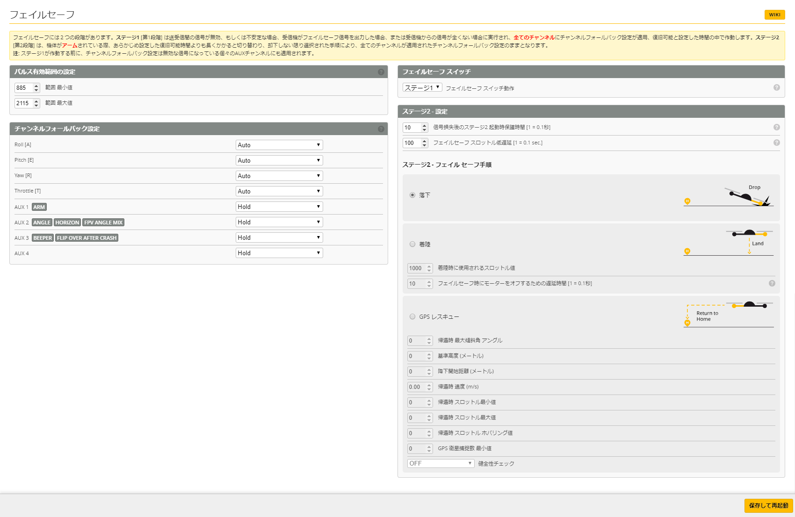

# フェイルセーフ
この項目は、機体と送信機の信号損失時に被害・リスクを最小限とするために施すフェイルセーフ設定となります。  
この設定は必ず実施をし、間違いなく動作するかを機体構築時に必ず確認を行ってください。  
※飛行中にワザと送信機の電源を落とし、フェイルセーフ動作するかの確認が一番簡単です。

### パルス有効範囲の設定
* 【885】 範囲 最小値
* 【2115】範囲 最大値  
※ 特に変更する必要はありません。(Betaflight上での最小値、最大値となり、この
値を変更した場合、意図しない挙動となりアームできなくなりますのでご注意ください。)

### フェイルセーフ スイッチ
* 【ステージ1】フェイルセーフ スイッチ動作  
※ 一番高い優先順位として、送信機側スイッチでフェイルセーフを発動させることが
可能となります。このままの設定で良いでしょう。

### ステージ2 - 設定
* 【4～10】信号損失後のステージ2機同時保護時間
* 【100】フェイルセーフ スロットル低遅延  
※ 送信機からの信号を失った場合(RX_LOST)、どのような時間経過で発動させるかのパラメータとなります。CrazyBee F3 FRでは、FrSkyプロトコルでの認識不具合を回避するため、リリース当初より【FrSky_D】＋【フェイルセーフ ステージ2保護時間：10】という安定設定が示されています。もし送信機のチャンネル条件に不満がなく安定稼働を目指す場合、不具合の見極めとして上記の値を覚えておくと良いでしょう。

### フェイルセーフ 手順
* 【落下】通常はこちらを選択ください  
※ 選択肢として、着陸やGPSレスキューの選択肢もありますが、65mm機体とはいえフェイルセーフ発動時に高度と加速がある場合、着陸を選択しても安全に着陸することはほぼ不可能となります。そのためまずは回転するプロペラによる事故を防止すること、如何に早く機体を安全に回収するかを想定し、通常は【落下】を選択します。またGPSモジュールの搭載ができませんので、この2つの設定は割愛致します。

### メニュー
Betaflight (詳細設定) の項目は以下の通りです。必要なページをお選びください：  

* [セットアップ](Betaflight%20-%20CrazyBeeF3FR.md)
* [ポート](Betaflight%20-%20CrazyBeeF3_Port.md)
* [基本設定](Betaflight%20-%20CrazyBeeF3_BaseSetting.md)
* [電源・バッテリー](Betaflight%20-%20CrazyBeeF3_Battery.md)
* [フェイルセーフ](Betaflight%20-%20CrazyBeeF3_failsafe.md)
* [PIDチューニング](Betaflight%20-%20CrazyBeeF3_PID.md)
* [受信機](Betaflight%20-%20CrazyBeeF3_Reciever.md)
* [モード](Betaflight%20-%20CrazyBeeF3_Mode.md)
* [調整](Betaflight%20-%20CrazyBeeF3_Addjust.md)
* [サーボ](Betaflight%20-%20CrazyBeeF3_Servo.md)
* [モーター](Betaflight%20-%20CrazyBeeF3_Motor.md)
* [OSD](Betaflight%20-%20CrazyBeeF3_OSD.md)
* [映像伝送用送信機](Betaflight%20-%20CrazyBeeF3_VTX.md)
* [センサー](Betaflight%20-%20CrazyBeeF3_Sensor.md)
* [テザーロギング](Betaflight%20-%20CrazyBeeF3_logging.md)
* [ブラックボックス](Betaflight%20-%20CrazyBeeF3_Blackbox.md)
* [CLI コマンドライン](Betaflight%20-%20CrazyBeeF3_CLI.md)

